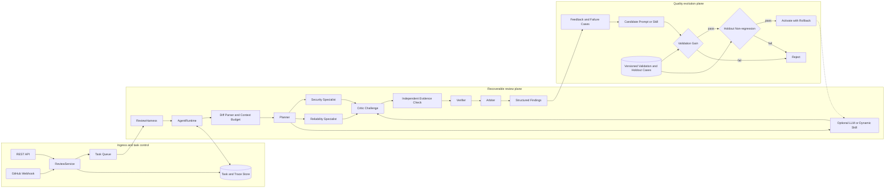

**English** | [简体中文](README_ZH.md)

# PR Review Agent

> A recoverable, evidence-driven multi-agent system for pull request review.

[](https://www.python.org/)
[](#verification)
[](LICENSE)

PR Review Agent turns a unified diff into a review process that can be inspected, resumed, and evaluated. Specialist agents propose risks, a critic challenges weak claims, an independent evidence role checks changed-line support, and a verifier plus arbiter decide which findings survive. The result is a structured JSON or Markdown report with file paths, line numbers, severity, evidence, remediation, and test guidance.

The project is built around one principle: a finding should carry a traceable reason for why it was discovered, challenged, verified, and retained.

## What the system provides

| Area | Current implementation |
|---|---|
| **Inputs** | Unified diffs, REST requests, or GitHub pull request webhooks |
| **Review runtime** | Bounded steps, timeouts, retries, cancellation, durable checkpoints, and resumable tasks |
| **Agent protocol** | Planner, security/reliability specialists, critic, evidence, verifier, and arbiter |
| **Outputs** | JSON and Markdown findings with rule ID, path, line, severity, evidence, fix, and test advice |
| **Local mode** | SQLite, an in-process queue, and deterministic rules; no external model required |
| **Service mode** | PostgreSQL, Redis Streams, Prometheus metrics, OpenTelemetry, and GitHub integration |
| **Quality loop** | Feedback produces prompt or declarative-skill candidates that must pass validation and holdout gates before activation |

## Architecture: online review and offline evolution

The diagram below follows the current `ReviewService`, `ReviewHarness`, `AgentRuntime`, `MultiAgentCoordinator`, evaluation, and evolution modules. The online plane produces evidence-backed findings. The offline plane decides whether a candidate prompt or skill is safe enough to enter a later review run.



## Finding quality gates

1. **Changed-line location** — `DiffParser` reconstructs file paths and added-line numbers. Review findings are constrained to code introduced by the pull request.
2. **Risk-domain assignment** — the planner routes work to security and reliability specialists; an LLM reviewer or a dynamic skill can act as an additional source, not as the final authority.
3. **Peer challenge** — the critic checks whether a claim is tied to an added line, whether its evidence matches the source, and whether the proposed remediation and test are actionable.
4. **Independent evidence** — the evidence role separately checks the path, line, source excerpt, and risk condition, leaving a replayable record of why a candidate was retained or rejected.
5. **Verification and arbitration** — the verifier applies evidence and confidence gates; the arbiter filters, deduplicates, and ranks the approved findings. Automatic repair uses a separate `RepairVerifier` with compilation and optional repository-test gates.

## Recoverable execution

A review is not treated as one indivisible function call. The runtime checkpoints three outer nodes:

```text
PENDING
   └─> PLANNING
          └─> EXECUTING
                 └─> REVIEWING
                        ├─> SUCCESS
                        ├─> FAILED
                        └─> CANCELLED
```

- Each task has step and wall-clock budgets.
- Failed specialist assignments can be retried and handed to a substitute role.
- A restarted worker resumes from the most recently completed checkpoint.
- Tool observations, agent messages, gate decisions, and failure reasons are persisted with the task.
- The asynchronous queue supports leases, acknowledgements, retries, and a dead-letter queue.

## Controlled offline evaluation

The repository includes a reproducible `synthetic-controlled` benchmark containing 100 PR diffs: 40 risk-bearing cases and 60 clean cases. Validation and holdout sets are separated by repository. Matching is one-to-one by path, CWE, and annotated line range, so duplicate predictions cannot receive duplicate credit.

| Metric | Single-agent baseline | Multi-agent candidate |
|---|---:|---:|
| F1 | `71.4%` | `82.5%` |
| High-risk recall | `84.2%` | `94.7%` |
| Clean-PR accuracy | — | `91.7%` |

These numbers validate the evaluation and regression pipeline on controlled synthetic data. They are **not** measurements from public pull requests or production repositories, and the included release gate deliberately blocks production activation until independently labelled real-world data is provided. The generator, dataset fingerprint, matching rules, and metric implementation are available in `evaluation_data/`, `evaluation_benchmark.py`, and `evaluation_harness.py`.

## Quick start

### Local deterministic mode

Local mode exercises the review workflow and web console without calling an external model.

```bash
git clone https://github.com/russlzc/--PRAgent.git PRAgent
cd PRAgent

python3.11 -m venv .venv
source .venv/bin/activate
python -m pip install -r requirements.txt
cp .env.example .env
python -m pragent
```

The service listens on `http://127.0.0.1:8080` by default.

Submit a unified diff:

```bash
curl -X POST http://127.0.0.1:8080/v1/reviews \
  -H 'Content-Type: application/json' \
  -d '{
    "repository": "demo/service",
    "pull_request": 12,
    "diff": "--- a/app.py\n+++ b/app.py\n@@ -1 +1 @@\n-safe_call(data)\n+eval(data)\n"
  }'
```

Create an asynchronous review and inspect its result:

```bash
curl -X POST 'http://127.0.0.1:8080/v1/reviews?async=true' \
  -H 'Content-Type: application/json' \
  -d @review.json

curl http://127.0.0.1:8080/v1/tasks/<task-id>
curl http://127.0.0.1:8080/v1/tasks/<task-id>/report
```

## Model and authentication configuration

The default is `PRAGENT_LLM_PROVIDER=local`. To add a model-backed reviewer, select DeepSeek, OpenRouter, or a custom OpenAI-compatible endpoint. For example:

```dotenv
PRAGENT_LLM_PROVIDER=custom
PRAGENT_LLM_BASE_URL=https://api.example.com/v1
PRAGENT_LLM_API_KEY=<your-token>
PRAGENT_LLM_MODEL=<model-name>
```

Enable authentication before exposing the service beyond a trusted local environment:

```dotenv
PRAGENT_AUTH_REQUIRED=true
PRAGENT_AUTH_SECRET=<at-least-32-random-bytes>
PRAGENT_BOOTSTRAP_ADMIN_USERNAME=admin
PRAGENT_BOOTSTRAP_ADMIN_PASSWORD=<strong-password>
```

`PRAGENT_AUTH_SECRET` is used for login sessions and must not be reused as the GitHub webhook secret.

## GitHub pull request integration

The `/webhooks/github` endpoint handles the `opened`, `reopened`, and `synchronize` pull request actions.

```dotenv
PRAGENT_GITHUB_WEBHOOK_SECRET=<independent-random-secret>
PRAGENT_GITHUB_TOKEN=<fine-grained-token>
PRAGENT_AUTO_POST_REVIEW=false
```

Grant only the permissions required by the enabled behavior:

- Reading private PR diffs: `Contents: Read`, `Pull requests: Read`
- Posting review results: `Pull requests: Read and write`
- Creating repair branches: `Contents: Read and write`, `Pull requests: Read and write`

Webhook handling includes HMAC-SHA256 signature verification, delivery idempotency, and an event-age check.

## Docker service mode

Docker Compose starts PR Review Agent with PostgreSQL and Redis. Set explicit credentials first:

```dotenv
PRAGENT_POSTGRES_PASSWORD=<database-password>
PRAGENT_AUTH_SECRET=<at-least-32-random-bytes>
PRAGENT_BOOTSTRAP_ADMIN_USERNAME=admin
PRAGENT_BOOTSTRAP_ADMIN_PASSWORD=<admin-password>
```

```bash
docker compose up --build
```

The Compose file is a controlled deployment reference. It does not include TLS termination, a reverse proxy, backups, a secret manager, or network-access policy.

## API surface

| Method | Path | Purpose |
|---|---|---|
| `GET` | `/health` | Health check |
| `GET` | `/metrics` | Prometheus metrics |
| `POST` | `/v1/auth/login` | Authenticate and obtain a token |
| `POST` | `/v1/reviews` | Create a synchronous or asynchronous review |
| `GET` | `/v1/tasks/{id}` | Read task state, trace, and findings |
| `GET` | `/v1/tasks/{id}/report` | Get the Markdown report |
| `POST` | `/v1/tasks/{id}/cancel` | Request cancellation |
| `POST` | `/v1/tasks/{id}/resume` | Resume from a checkpoint |
| `POST` | `/v1/tasks/{id}/feedback` | Record false-positive, missed-issue, or unsafe-fix feedback |
| `POST` | `/v1/tasks/{id}/fix` | Create a gate-protected repair branch |
| `POST` | `/webhooks/github` | Receive pull request events |
| `POST` | `/v1/evolution/auto` | Generate and evaluate a prompt candidate |
| `POST` | `/v1/skill-evolution/auto` | Generate and evaluate a declarative-skill candidate |

## Repository map

```text
pragent/
├── runtime.py              Bounded agent loop, tool registry, and checkpoints
├── harness.py              Planning / Executing / Reviewing orchestration
├── agents.py               Planner, specialists, critic, evidence, and arbiter
├── context_manager.py      Diff compression, token budgets, and risk context
├── memory.py               Working, episodic, and semantic memory
├── service.py              Review service and task lifecycle
├── store.py                SQLite persistence
├── postgres_store.py       PostgreSQL adapter
├── task_queue.py           In-process queue and Redis Streams
├── evaluation_harness.py   One-to-one finding matching and metrics
├── evolution.py            Prompt candidates, gates, activation, and rollback
├── skill_evolution.py      Declarative-skill version chain
├── verifier.py             Evidence and repair-safety verification
└── api.py                  REST API, webhook, and administration endpoints

web/                        Build-free management console
skills/code-quality/        Example dynamic review skill
evaluation_data/            100 controlled PR diffs
scripts/                    Evaluation, evolution proof, and data import
tests/                      53 unit and integration tests
```

## Verification

```bash
# Full test suite
python -m unittest discover -s tests -v

# Controlled end-to-end evaluation
python scripts/run_e2e_evaluation.py

# Prompt-evolution proof
python scripts/run_prompt_evolution_proof.py

# Compose configuration validation
docker compose config -q
```

The current published version passes `53/53` automated tests. The Docker runtime uses Python 3.11. Model providers, live GitHub access, PostgreSQL, and Redis still depend on their external services and deployment configuration.

## Security boundaries

- `.env` files, tokens, private keys, databases, reports, traces, and generated outputs are excluded from version control.
- External model providers receive diff and review context; confirm their data policy before sending private code.
- Dynamic skills are restricted by import, time, and memory controls and can run in a read-only, network-disabled container. This is not a general-purpose malicious-code sandbox.
- Automatic repair covers a limited set of deterministic rules and is guarded by syntax and optional test checks. Every patch still requires human review before merge.
- Multi-agent agreement is not proof that a vulnerability is real; repository owners remain responsible for the final decision.

## License

This repository is published for portfolio and recruitment evaluation only. No permission is granted to copy, modify, distribute, deploy, or use it commercially. See [LICENSE](LICENSE).
