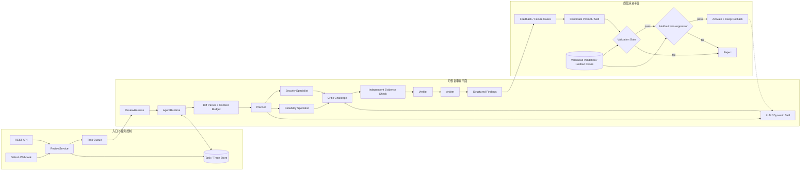

[English](README.md) | **简体中文**

# PR Review Agent｜可恢复、可追溯的多 Agent 代码审查系统

[](https://www.python.org/)
[](#验证项目)
[](LICENSE)

PR Review Agent 接收 Pull Request Diff，把一次代码审查拆成可检查、可恢复的协作过程：先定位新增代码中的候选风险，再由不同角色提出质疑、补充证据、验证修复安全性，最后输出带文件路径、行号、证据和测试建议的结构化 Finding。

> 设计目标不是让多个 Agent 重复说同一件事，而是让每个 Finding 都经历“谁发现、谁质疑、谁复核、为什么保留”的证据链。

## 项目速览

| | 系统设计 |
|---|---|
| **输入** | Unified Diff、REST API 请求或 GitHub Pull Request Webhook |
| **执行内核** | 有界 Runtime 管理状态、步骤预算、超时、重试、取消与 Checkpoint |
| **协作角色** | Planner、Security / Reliability Specialist、Critic、Evidence、Verifier、Arbiter |
| **输出** | JSON / Markdown Finding，包含规则 ID、路径、行号、严重级别、证据、修复与测试建议 |
| **本地模式** | SQLite + 进程内队列 + 确定性规则，无需外部模型 |
| **服务模式** | PostgreSQL、Redis Streams、Prometheus、OpenTelemetry、GitHub App / Token |
| **质量闭环** | 反馈生成 Prompt 或声明式 Skill 候选；候选通过独立 Validation / Holdout 回放门禁后才激活 |

## 在线审查与离线演进如何连接

下面的图根据当前 `ReviewService`、`ReviewHarness`、`AgentRuntime`、`MultiAgentCoordinator` 和 Evolution 模块重新绘制：在线链路负责产出证据型 Finding，离线链路负责决定新的 Prompt 或 Skill 是否有资格进入下一轮审查。



## 一个 Finding 要经过哪些关

### 1. Diff 位置约束

`DiffParser` 先恢复文件路径与新增行号。规则和 Agent 只允许把 Finding 绑定到新增代码，避免把历史问题错误归因给当前 PR。

### 2. 风险域分工

Planner 根据变更内容创建审查计划，Security 与 Reliability Specialist 并行处理不同风险域；可选 LLM Reviewer 和动态 Skill 作为额外候选来源，而不是最终裁决者。

### 3. Critic 挑战

候选 Finding 需要回答：证据是否真的位于新增行、风险描述是否过度推断、修复建议是否会改变业务语义。被挑战的 Finding 可以修订，也可以被撤回。

### 4. 独立证据复核

Evidence 角色独立于 Specialist 重新检查路径、行号、代码片段和风险条件。复核结果与原候选分开保存，便于回放“为什么留下这条告警”。

### 5. Verifier 与 Arbiter 收口

Verifier 检查证据是否可复现、置信度是否达标，以及修复建议是否具备可操作性；Arbiter 根据证据状态、严重级别和重复键进行过滤、去重与排序，最终生成 JSON 和 Markdown 报告。自动修复则由独立的 `RepairVerifier` 执行编译与可选仓库测试。

## 可恢复执行

审查不是一次不可中断的函数调用。Runtime 把执行拆成三个外层节点，并在节点完成后保存 Checkpoint：

```text
PENDING
   └─> PLANNING
          └─> EXECUTING
                 └─> REVIEWING
                        ├─> SUCCESS
                        ├─> FAILED
                        └─> CANCELLED
```

- 每个任务都有步骤数与总时长预算；
- Specialist 失败可以重试，并由替补角色接手；
- 进程中断后从最近完成节点恢复，不重复已经持久化的阶段；
- Tool Observation、Agent 消息、门禁结果和错误原因随任务保存；
- 异步队列支持 lease、ACK、重试与 Dead Letter Queue。

## 受控离线评测

仓库包含 100 条 `synthetic-controlled` PR Diff：40 条带风险样本、60 条干净样本。匹配器使用路径、CWE 和标注行区间进行一对一匹配，避免重复 Finding 被重复计分；Validation 与 Holdout 按仓库隔离。

| 指标 | 单 Agent 基线 | 多 Agent 候选 |
|---|---:|---:|
| F1 | `71.4%` | `82.5%` |
| 高风险召回率 | `84.2%` | `94.7%` |
| 干净 PR 准确率 | — | `91.7%` |

这些数字验证的是受控数据上的回归链路，不等同于真实公开 PR 或生产仓库准确率。数据生成器、指纹、匹配逻辑和指标计算均保存在 `evaluation_data/`、`evaluation_benchmark.py` 与 `evaluation_harness.py` 中。

## 快速运行

### 本地规则模式

本地模式不调用外部模型，可以直接体验完整审查链和 Web 管理台。

```bash
git clone https://github.com/russlzc/--PRAgent.git PRAgent
cd PRAgent

python3.11 -m venv .venv
source .venv/bin/activate
python -m pip install -r requirements.txt
cp .env.example .env
python -m pragent
```

默认地址为 `http://127.0.0.1:8080`。

提交一段 Unified Diff：

```bash
curl -X POST http://127.0.0.1:8080/v1/reviews \
  -H 'Content-Type: application/json' \
  -d '{
    "repository": "demo/service",
    "pull_request": 12,
    "diff": "--- a/app.py\n+++ b/app.py\n@@ -1 +1 @@\n-safe_call(data)\n+eval(data)\n"
  }'
```

异步模式与报告查询：

```bash
curl -X POST 'http://127.0.0.1:8080/v1/reviews?async=true' \
  -H 'Content-Type: application/json' \
  -d @review.json

curl http://127.0.0.1:8080/v1/tasks/<task-id>
curl http://127.0.0.1:8080/v1/tasks/<task-id>/report
```

## 模型与认证配置

默认 `PRAGENT_LLM_PROVIDER=local`。需要模型参与时，可以选择 DeepSeek、OpenRouter 或自定义 OpenAI-compatible 端点：

```dotenv
PRAGENT_LLM_PROVIDER=custom
PRAGENT_LLM_BASE_URL=https://api.example.com/v1
PRAGENT_LLM_API_KEY=<your-token>
PRAGENT_LLM_MODEL=<model-name>
```

服务对局域网或公网开放前必须启用身份验证：

```dotenv
PRAGENT_AUTH_REQUIRED=true
PRAGENT_AUTH_SECRET=<at-least-32-random-bytes>
PRAGENT_BOOTSTRAP_ADMIN_USERNAME=admin
PRAGENT_BOOTSTRAP_ADMIN_PASSWORD=<strong-password>
```

`PRAGENT_AUTH_SECRET` 只用于登录会话，不能与 GitHub Webhook Secret 共用。

## GitHub Pull Request 接入

Webhook 地址为 `/webhooks/github`，处理 `pull_request` 的 `opened`、`reopened` 与 `synchronize` 事件。

```dotenv
PRAGENT_GITHUB_WEBHOOK_SECRET=<independent-random-secret>
PRAGENT_GITHUB_TOKEN=<fine-grained-token>
PRAGENT_AUTO_POST_REVIEW=false
```

按实际功能授予最小权限：

- 读取私有 PR Diff：`Contents: Read`、`Pull requests: Read`；
- 回写审查结果：`Pull requests: Read and write`；
- 创建修复分支：`Contents: Read and write`、`Pull requests: Read and write`。

Webhook 验证包含 HMAC-SHA256 签名、Delivery 幂等和事件时间窗检查。

## Docker 服务模式

Compose 启动 PR Review Agent、PostgreSQL 和 Redis。启动前必须显式提供密码与认证密钥：

```dotenv
PRAGENT_POSTGRES_PASSWORD=<database-password>
PRAGENT_AUTH_SECRET=<at-least-32-random-bytes>
PRAGENT_BOOTSTRAP_ADMIN_USERNAME=admin
PRAGENT_BOOTSTRAP_ADMIN_PASSWORD=<admin-password>
```

```bash
docker compose up --build
```

该 Compose 文件用于受控部署参考，不包含 TLS、反向代理、备份、Secret Manager 和网络访问策略。

## 主要 API

| 方法 | 路径 | 用途 |
|---|---|---|
| `GET` | `/health` | 健康检查 |
| `GET` | `/metrics` | Prometheus 指标 |
| `POST` | `/v1/auth/login` | 登录并获取 Token |
| `POST` | `/v1/reviews` | 创建同步或异步审查 |
| `GET` | `/v1/tasks/{id}` | 查询状态、Trace 与 Finding |
| `GET` | `/v1/tasks/{id}/report` | 获取 Markdown 报告 |
| `POST` | `/v1/tasks/{id}/cancel` | 请求取消 |
| `POST` | `/v1/tasks/{id}/resume` | 从 Checkpoint 恢复 |
| `POST` | `/v1/tasks/{id}/feedback` | 提交误报、漏报或坏修复反馈 |
| `POST` | `/v1/tasks/{id}/fix` | 创建受门禁保护的修复分支 |
| `POST` | `/webhooks/github` | 接收 Pull Request 事件 |
| `POST` | `/v1/evolution/auto` | 生成并评测 Prompt 候选 |
| `POST` | `/v1/skill-evolution/auto` | 生成并评测声明式 Skill 候选 |

## 代码导航

```text
pragent/
├── runtime.py              有界 Agent Loop、Tool Registry 与 Checkpoint
├── harness.py              Planning / Executing / Reviewing 状态编排
├── agents.py               Planner、Specialist、Critic、Evidence、Arbiter
├── context_manager.py      Diff 压缩、Token 预算与风险上下文
├── memory.py               Working / Episodic / Semantic Memory
├── service.py              审查服务与任务生命周期
├── store.py                SQLite 持久化
├── postgres_store.py       PostgreSQL Adapter
├── task_queue.py           进程内队列与 Redis Streams
├── evaluation_harness.py   一对一 Finding 匹配与指标
├── evolution.py            Prompt 候选、门禁、激活与回滚
├── skill_evolution.py      声明式 Skill 版本链
├── verifier.py             证据与修复安全验证
└── api.py                  REST API、Webhook 与管理端点

web/                        无构建步骤的管理台
skills/code-quality/        动态审查 Skill 示例
evaluation_data/            100 条受控 PR Diff
scripts/                    评测、演进证明与数据导入
tests/                      53 项单元与集成测试
```

## 验证项目

```bash
# 全量测试
python -m unittest discover -s tests -v

# 受控端到端评测
python scripts/run_e2e_evaluation.py

# Prompt 演进证明
python scripts/run_prompt_evolution_proof.py

# Compose 配置验证
docker compose config -q
```

当前发布版本完成 `53/53` 自动化测试；Docker 默认运行时为 Python 3.11。模型、真实 GitHub App、PostgreSQL 和 Redis 的在线行为仍取决于外部服务与部署配置。

## 安全边界

- `.env`、Token、私钥、数据库、报告、Trace 和生成输出不进入 Git。
- 外部模型会接收到 Diff 与审查上下文；发送私有代码前需要确认数据政策。
- 动态 Skill 运行时限制导入、时间与内存，也可以放入只读、无网络容器；它不是通用恶意代码沙箱。
- 自动修复只覆盖少量确定性规则，并经过语法与可选测试门禁；合并前仍需人工审查。
- 多 Agent 共识不等于漏洞真实性，最终结论仍应由代码所有者复核。

## 使用声明

本仓库仅公开用于项目展示与招聘评估，不授予复制、修改、分发、部署或商业使用许可，详见 [LICENSE](LICENSE)。
